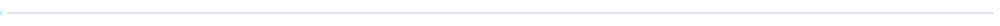

<div align="center">
  
  <h1>MOHD KAIF</h1>
  <p><strong>Computer Engineering Student · Developer Tools · Interactive Systems</strong></p>
  <p>I build tools that make code easier to explore and systems easier to understand.</p>
  <p>
    <a href="#featured-work">Featured work</a> ·
    <a href="#toolbox">Toolbox</a> ·
    <a href="https://linkedin.com/in/mohd-kaif-shaikh-912868324">Connect</a>
  </p>
</div>

<div align="center">
  
</div>

## Featured work

| Project | What it does | Built with |
|---|---|---|
| [BrainGraph](https://github.com/Dislike12/BrainGraph) | Maps a codebase and produces focused context for AI-assisted development, with a local-first approach. | Python |
| [x86 Studio — 8086 IDE](https://github.com/Dislike12/8086-V2.1) | An educational IDE that translates a custom language into assembly and runs it in a virtual CPU. | TypeScript · React |
| [Python Project Lab](https://github.com/Dislike12/python) | Five documented command-line tools, each with tests; CI checks Python 3.10, 3.11, and 3.12. | Python · unittest · Ruff |
| [Repo Checkup](https://github.com/Dislike12/repo-checkup) | A local-only first-pass checklist for common repository files—not a security scanner or quality score. | Python · pytest · Ruff |

## Toolbox

**Languages** · Python · TypeScript · JavaScript · Rust · C<br />
**Build & test** · React · Vite · Git · GitHub Actions · pytest · unittest · Ruff

## How I like to build

```text
Make it useful  →  Keep it understandable  →  Prove it works
```

I’m especially interested in developer tooling, code intelligence, compilers, emulators, and approachable learning software. I value clear scope, readable documentation, and checks that make a project reproducible.

## Explore

- [Browse my public repositories](https://github.com/Dislike12?tab=repositories)
- [See my public contribution activity](https://github.com/Dislike12)
- [Connect on LinkedIn](https://linkedin.com/in/mohd-kaif-shaikh-912868324)

---

<p align="center"><sub>Designed to stay readable in plain text; the animated artwork is self-hosted in this repository.</sub></p>
